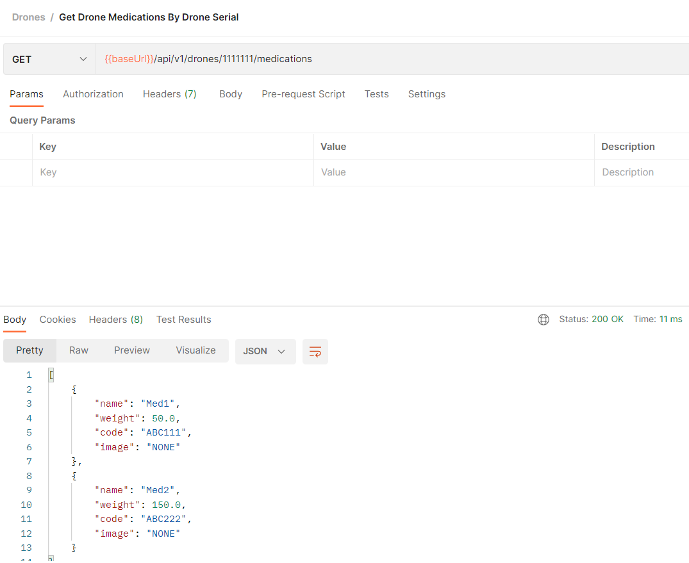

## Drones API - Background

---

### Introduction

There is a major new technology that is destined to be a disruptive force in the field of transportation: **the drone**.
Just as the mobile phone allowed developing countries to leapfrog older technologies for personal communication, the
drone has the potential to leapfrog traditional transportation infrastructure.

Useful drone functions include delivery of small items that are (urgently) needed in locations with difficult access.

---

### Task description

We have a fleet of **10 drones**. A drone is capable of carrying devices, other than cameras, and capable of delivering
small loads. For our use case **the load is medications**.

A **Drone** has:

- serial number (100 characters max);
- model (Lightweight, Middleweight, Cruiserweight, Heavyweight);
- weight limit (500gr max);
- battery capacity (percentage);
- state (IDLE, LOADING, LOADED, DELIVERING, DELIVERED, RETURNING).

Each **Medication** has:

- name (allowed only letters, numbers, ‘-‘, ‘_’);
- weight;
- code (allowed only upper case letters, underscore and numbers);
- image (picture of the medication case).

Develop a service via REST API that allows clients to communicate with the drones (i.e. **dispatch controller**). The
specific communicaiton with the drone is outside the scope of this task.

The service should allow:

- registering a drone;
- loading a drone with medication items;
- checking loaded medication items for a given drone;
- checking available drones for loading;
- check drone battery level for a given drone;

> Feel free to make assumptions for the design approach.

---

### Requirements

While implementing your solution **please take care of the following requirements**:

#### Functional requirements

- There is no need for UI;
- Prevent the drone from being loaded with more weight that it can carry;
- Prevent the drone from being in LOADING state if the battery level is **below 25%**;
- Introduce a periodic task to check drones battery levels and create history/audit event log for this.

---

#### Non-functional requirements

- Input/output data must be in JSON format;
- Your project must be buildable and runnable;
- Your project must have a README file with build/run/test instructions (use DB that can be run locally, e.g. in-memory,
  via container);
- Required data must be preloaded in the database.
- JUnit tests are optional but advisable (if you have time);
- Advice: Show us how you work through your commit history.

---

## Drones API - Solution

---

### Build Dependencies

- Java 17
- IntelliJ Idea / Any Other IDE
- Maven
- Postman - To test the APIs
- Docker (Optional)

---

### Installation and Setup

---

1. Clone the repository from https://github.com/sharaafnazeer/drones-app in to your local machine
2. Open the project directory and open the project folder in the IDE / Command prompt
3. In the terminal, run the following command to install the dependencies:

```
   mvn clean install
 ```

### Running the Application

---

1. Run the following command to run the application or use the option provided by the IDE

```
   mvn spring-boot:run
 ```

2. Drones application will start working on ```port 8080``` on your machine.

---

### Running the Application - Using Docker

---

If you want to use docker to run the application please follow the steps.

1. Run the following command to build the docker image

```
    docker build -t drone-docker:drone-docker .
```

2. Run the following command to start the container and run the application in detached mode

```
    docker run -p 8080:8080 drone-docker:drone-docker .
```

3. Drones application will start working on ```port 8080``` on your machine.

---

### Assumptions and Design Decisions

---

- I have made an assumption that One medication can be loaded in to one drone and one drone can have multiple
  medications loaded.
- Therefore, There are two tables created to hold **Drone** details and **Medication** details. This has a **one-to-many
  ** relationship employed.
- Since delivery and other details are not included in the functional requirements, I did not implement them in this
  application. Otherwise, the data model logic might slightly change based on the requirements.
- Audit logs are captured periodically based on the configuration provided (30 secs as of now). But can change that
  accordingly.
- I have captured the audit logs in two tables **AuditLog** and **DroneBatteryAudit** where one **AuditLog** can have
  multiple **DroneBatteryAudit** records. And **AuditLog** can be used to log any other cases as well.
- I have selected an in-memory database (H2) to persist data. Thus, when the application restarts the persisted data
  will be flushed. You can visit the DB interface via ```http://localhost:8080/h2-console``` (Will not work, when
  running with docker. Needs additional configurations). Username and password will be *
  *admin**
- When a drone is registered it will be in the **IDLE** state and will have the **currentWeight** as 0. and the *
  *currentWeight** will be increased based on the weight of loaded medications.
- Number of registered drones can not exceed the fleet size.
- Validations are employed for **Drone** and **Medication**. and the API will respond with error messages if their any.
- Resources folder contains a **data.sql** file which will be used to load the pre-data to the Database

### Testing the APIs

---

Can use Postman or any other Rest API clients to test the APIs.

**ContentType** should be **application/json**
Replace ```{{baseUrl}}``` with ```http://localhost:8080```

1. Register a drone - **POST**

```
   {{baseUrl}}/api/v1/drones/register
 ```


2. Check available drones for loading medications - **GET**

```
   {{baseUrl}}/api/v1/drones/available
 ```


3. Check battery level of a drone - **GET**

```
   {{baseUrl}}/api/v1/drones/{{droneSerialNumber}}/battery
 ```

Replace ```{{droneSerialNumber}}``` with actual drone serial number


4. Loading the drone with medications - **POST**

```
   {{baseUrl}}/api/v1/drones/load
 ```


5. Get loaded medications for a drone - **GET**

```
   {{baseUrl}}/api/v1/drones/{{droneSerialNumber}}/medications
 ```

Replace ```{{droneSerialNumber}}``` with actual drone serial number



6. Save medication - **POST**

```
   {{baseUrl}}/api/v1/medications
 ```


7. Get all medications - **GET**

```
   {{baseUrl}}/api/v1/medications
 ```


### Unit Tests of Service Methods and Controller Methods

---

- Use the following command to run Unit test for the entire application where it is applicable.

```
   mvn test
 ```

- Use the following command to run Unit test for a specific class. Replace ```TestClassName``` with one of the actual
  class name.

```
mvn test -Dtest="TestClassName"
```